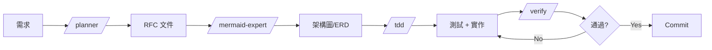

# agentic-workflow-template 評價報告

**測試日期：** 2025-01-29
**測試項目：** Todo API 開發流程
**測試的 Skills：** planner, mermaid-expert, tdd, verify, database-optimizer

---

## 📊 總體評分：⭐⭐⭐⭐ (4/5)

---

## ✅ 優點

### 1. 結構清晰，流程完整
- 從規劃 (planner) → 設計 (mermaid) → 開發 (tdd) → 驗證 (verify) → 優化 (database-optimizer)
- 覆蓋了軟體開發生命週期的主要階段

### 2. 文件品質高
- 每個 skill 都有詳細的範例程式碼
- 包含「做」和「不做」的對比示範
- Markdown 格式清晰易讀

### 3. 實用的模板
- RFC 模板 (`rfc-template.md`) 很完整
- TDD 的 Red-Green-Refactor-Verify 循環說明清楚
- Verification Loop 的 6 階段很實用

### 4. 技術深度足夠
- Database Optimizer 涵蓋了索引、N+1、快取等進階主題
- TDD skill 包含了 Unit/Integration/E2E 測試模式
- Mermaid skill 支援多種圖表類型

---

## ⚠️ 可改進之處

### 1. Plane MCP 整合是可選的
- Planner 和 TDD skill 提到 Plane 同步，但沒有 Plane 也能用
- 建議：明確標示哪些功能是 optional

### 2. 缺少快速入門指南
- 新手可能不知道從哪個 skill 開始
- 建議：在 README 加入「30 秒快速開始」

### 3. 語言/框架假設
- 範例主要是 Python (FastAPI) + TypeScript
- 建議：可以有更多語言的範例或說明是可抽換的

### 4. Skills 之間的依賴關係不明確
- 例如 planner 產出 RFC 後，如何「交接」給 tdd？
- 建議：加入 workflow 流程圖

---

## 📝 具體建議

### 1. 加入 Workflow 圖


### 2. 加入 QUICKSTART.md
```markdown
# 5 分鐘上手

1. 有新需求？ → `/planner 描述需求`
2. 需要畫圖？ → `/diagram erd 資料模型`
3. 開始開發？ → `/tdd ISSUE-123`
4. 準備提交？ → `/verify`
```

### 3. 標準化輸出位置
- RFC → `docs/rfc/`
- 圖表 → `docs/diagrams/`
- 測試 → `tests/`

---

## 🎯 結論

這個 template **很好用**，特別適合：
- 想建立開發規範的團隊
- 需要 AI 輔助開發流程的專案
- 想學習業界最佳實踐的開發者

對於測試的 5 個 skills，每個都能獨立運作，文件也足夠詳細讓 AI Agent 理解並執行。

**推薦度：值得採用** 👍

---

## 📁 測試產出檔案

| 檔案 | 對應 Skill |
|------|------------|
| `RFC-001-todo-api.md` | planner |
| `todo-erd.md` | mermaid-expert |
| `test_todos.py` | tdd |
| `verify-steps.md` | verify |
| `db-optimization.md` | database-optimizer |
