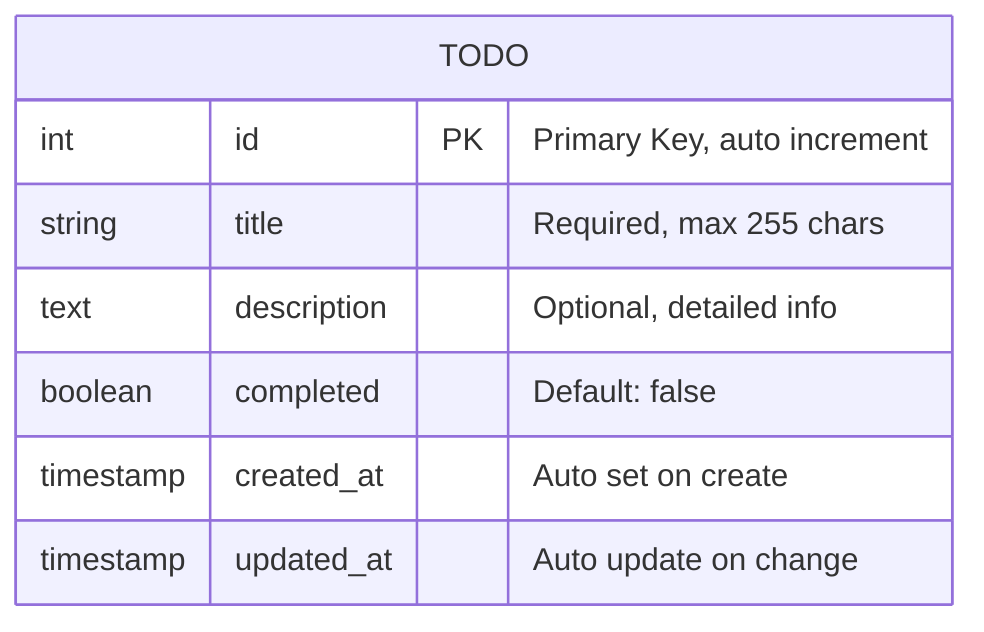
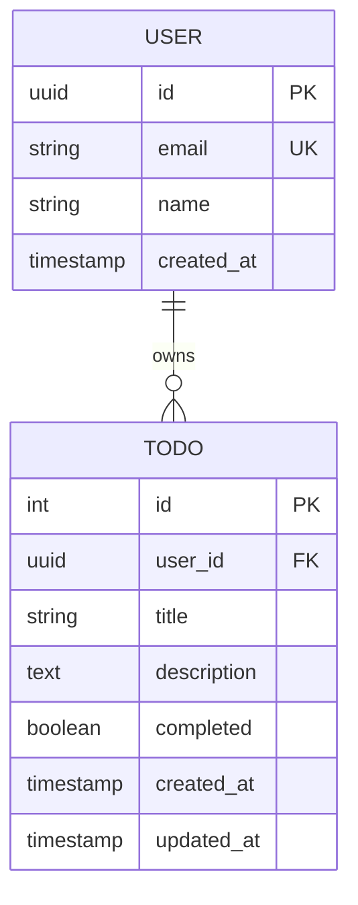

# Todo API - ERD (Entity Relationship Diagram)

根據 `mermaid-expert` skill 產出的資料庫模型圖。

## ERD 圖表

## 說明

- **TODO** 是唯一的實體
- `id`: 自動遞增的主鍵
- `title`: 必填欄位，待辦事項標題
- `description`: 選填欄位，詳細描述
- `completed`: 布林值，預設為 false
- `created_at` / `updated_at`: 自動管理的時間戳記

## 未來擴展 (如果加入使用者系統)

## 渲染方式

- GitHub/GitLab Markdown 原生支援
- [Mermaid Live Editor](https://mermaid.live)
- VS Code + Markdown Preview Mermaid 擴充
